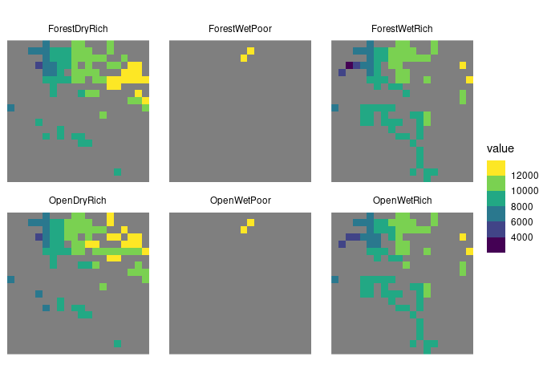
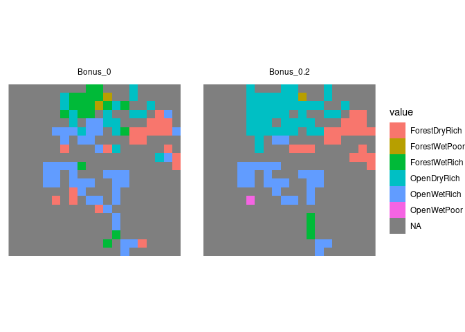

<!-- README.md is generated from README.Rmd. Please edit that file -->

# LanduseHanneProblem

<!-- badges: start -->
<!-- badges: end -->

The goal of LanduseHanneProblem is to …

1.  Sets:

- $Cells,$: Vertex set of the spatial graph. LandusesLanduses: Name of
  possible land uses.

2.  Parameters:

- $Richness_{c,l}$: Number of species in each cell $c$ for each land use
  $l$.

- $PhyloDiversity_{c,l}$: Phylogenetic diversity in each cell $c$ for
  each land use $l$.

- $SuitabilityLanduse_{c,l}$: Suitability for each cell $c$ in each land
  use $l$.

- $TransitionCost{c,l}$: Cost of transforming a cell $c$ to land use
  $l$.

- $b$: Budget.

3.  Decision Variables:

- $LanduseDecision_{c, l}$: Binary decision variable indicating whether
  land use $l$ is chosen for cell $c$.

4.  Objective Function:

$\text{Maximize } \text{ConservationIndex} = \sum_{l \in \text{Landuses}} \sum_{c \in \text{Cells}} \text{LanduseDecision}_{l,c} \cdot \text{Richness}_{l,c} \cdot \text{PhyloDiversity}_{l,c}$

Constraints:

- Proportional Use Constraint:

$\text{Subject to ProportionalUse}_{c}: \sum_{l \in \text{Landuses}} \text{LanduseDecision}_{l,c} \cdot \text{SuitabilityLanduse}_{l,c} = 1 \quad \forall c \in \text{Cells}$

- Budget Constraint:

$\text{Subject to Budget}: \sum_{l \in \text{Landuses}} \sum_{c \in \text{Cells}} \text{LanduseDecision}_{l,c} \cdot \text{TransitionCost}_{l,c} = b$

Here, $LanduseDecision_{c, l}$ is a binary decision variable that is 1
if land use $l$ is chosen for cell $c$ and 0 otherwise. The objective
function aims to maximize the conservation index, which is the product
of richness, phylogenetic diversity, and the decision variable.

The Proportional Use constraint ensures that for each cell, the sum of
the decision variables weighted by suitability is equal to 1,indicating
that exactly one land use is chosen for each cell.

The Budget constraint ensures that the total cost of transitioning cells
to their chosen land uses does not exceed the budget $b$

This model can be solved using linear programming techniques to find the
optimal land-use decisions that maximize the conservation index within
the given budget.

All this is summarized in this code for ampl

``` bash
set Cells;   # vertex set of the spacial graph
set Landuses; # Name of possible Landuses

param Richness {Landuses, Cells}; # Number of species in each cell for each landuse
param PhyloDiversity {Landuses,Cells}; # Phylogenetic diversity in each cell for each landuse

param TransitionCost {Landuses, Cells}; # Cost of transforming a cell to this landuse
param b; #budget

var LanduseDecision {l in Landuses, c in Cells} binary; # decision on which landuse to use for cell

maximize ConsevartionIndex:
  sum{l in Landuses, c in Cells} LanduseDecision[l,c]*Richness[l,c]*PhyloDiversity[l,c];

subj to PropotionalUse{c in Cells}:
  sum{l in Landuses} LanduseDecision[l,c] <= 1;

subj to Budget:
  sum{l in Landuses, c in Cells} LanduseDecision[l,c]*TransitionCost[l,c] = b;
```

# Problem generation

## Loading packages

For this we will use the following R packages

``` r
library(terra)
#> terra 1.7.62
library(ggplot2)
library(TroublemakeR)
library(stringr)
library(tidyterra)
#> 
#> Attaching package: 'tidyterra'
#> The following object is masked from 'package:stats':
#> 
#>     filter
```

## Making the variables

### Phylogenetic diversity

First we start generating the Phylogenetic diversity stack:

``` r
PD <- list.files(path = "Vilhelmsborg_test/", pattern = "^PD_.*\\.tif$", full.names = T) |> rast()

PDNames <- list.files(path = "Vilhelmsborg_test/", pattern = "^PD_.*\\.tif$", full.names = F) |> 
  stringr::str_remove_all(".tif") |> 
  stringr::str_remove_all("PD_")

names(PD) <- PDNames
```

This dataset looks like this:

<!-- -->

This is problematic, since we need that if there are some NAs in layers
where other cells have values, this will generate a problem, to solve
that we use the following code

``` r
# Turn all NAs into 0
PD[is.na(PD)] <- 0
# The make a raster where you sum all the values
SumPD <- app(PD, sum) 
# Finally where everything is 0 based on SumPD, turn it back to NA
PD[SumPD == 0] <- NA
```

With this we change the layer into this figure:

<!-- -->

Now all the cells that have a value in one landuse will have a value in
all landuses, but all other cells are just NA to avoid having to take
more decisions than necessary.

We also need to normalize of values from 0 to 1, in order to then
compare it later with Richness, as this give equal weight to both layers

``` r
NormPD <- round((PD/max(minmax(PD))), 2)
```

This results in the following plot:

<!-- -->

### Species richness

We use the same code for richness

``` r
Richness <- list.files(path = "Vilhelmsborg_test/", pattern = "^richness_.*\\.tif$", full.names = T) |> rast()

RichnessNames <- list.files(path = "Vilhelmsborg_test/", pattern = "^richness_.*\\.tif$", full.names = F) |> 
  stringr::str_remove_all(".tif") |> 
  stringr::str_remove_all("richness_")

names(Richness) <- RichnessNames

# Turn all NAs into 0
Richness[is.na(Richness)] <- 0
# The make a raster where you sum all the values
SumRichness <- app(Richness, sum) 
# Finally where everything is 0 based on SumPD, turn it back to NA
Richness[SumRichness == 0] <- NA

NormRichness <- round((Richness/max(minmax(Richness))), 2)
```

This turns into the following figure:

<!-- -->

## Number of cells for a desicion

``` r
n_cell <- sum(!is.na(values(PD[[1]])))
```

the number of cells where desicions can be taken are 113

## Generate problem

``` r
TroublemakeR::define_cells(Rasterdomain = NormPD[[1]], name = "Test")

TroublemakeR::landuse_names(landuses = PDNames, name = "Test")

TroublemakeR::species_suitability(Rastercurrent = NormPD, species_names = PDNames, parameter = "PhyloDiversity", name = "Test")

TroublemakeR::species_suitability(Rastercurrent = NormRichness, species_names = RichnessNames, parameter = "Richness", name = "Test")

TroublemakeR::write_ampl_lines("param TransitionCost default 1", name = "Test")

TroublemakeR::write_ampl_lines("param b := 100", name = "Test")
```

``` r
library(readr)
library(dplyr)
#> 
#> Attaching package: 'dplyr'
#> The following objects are masked from 'package:terra':
#> 
#>     intersect, union
#> The following objects are masked from 'package:stats':
#> 
#>     filter, lag
#> The following objects are masked from 'package:base':
#> 
#>     intersect, setdiff, setequal, union
Solution1 <- read_table("Solution1.txt", 
    col_names = FALSE) |> magrittr::set_colnames(c("cell", "landuse", "des")) |> dplyr::filter(des == 1) 
#> 
#> ── Column specification ────────────────────────────────────────────────────────
#> cols(
#>   X1 = col_double(),
#>   X2 = col_character(),
#>   X3 = col_double()
#> )
```

``` r
Temp <- PD[[1]]
values(Temp) <- NA
values(Temp)[Solution1$cell] <- Solution1$landuse
```

``` r
plot(Temp, colNA = "black")
```

<!-- -->
