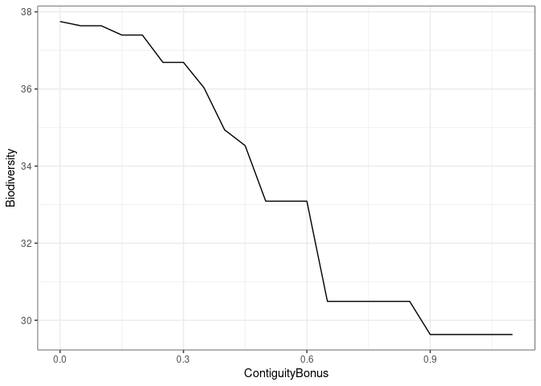
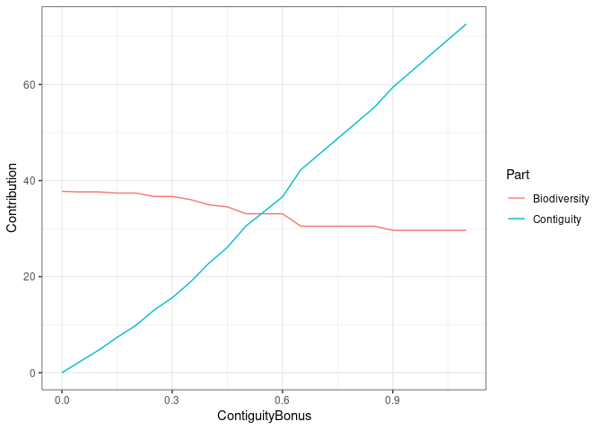
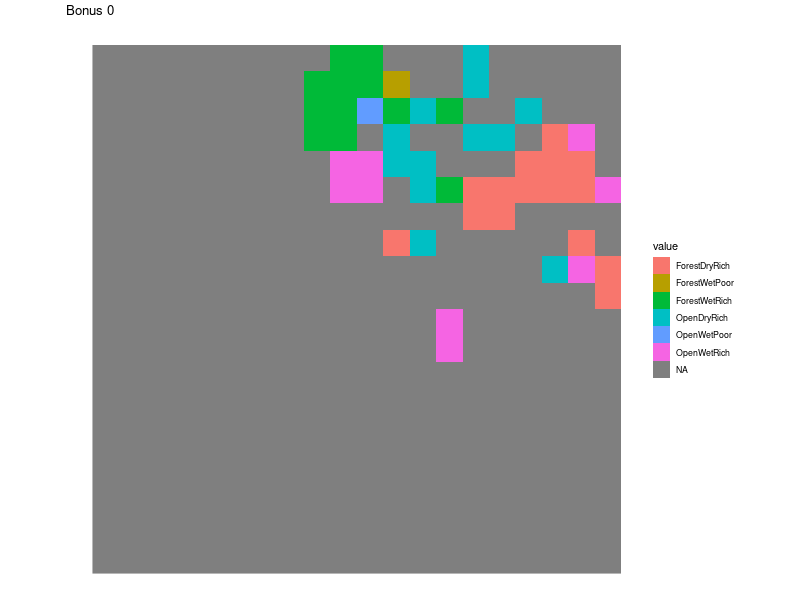

Sensitivity analysis
================

The objective of this sensitity analysis is to check the sensitivity of
the SpatialContiguityBonus in solving a problem, for that we first
create a problem witouth defining this first:

## Loading packages

``` r
library(terra)
library(ggplot2)
library(TroublemakeR)
library(stringr)
library(tidyterra)
library(gifski)
library(dplyr)
```

after loading the packages we generate the necessary spatial data

``` r
PD <- list.files(path = "/home/au687614/Documents/LanduseHanneProblem/Vilhelmsborg_test/", pattern = "^PD_.*\\.tif$", full.names = T) |> rast()

PDNames <- list.files(path = "/home/au687614/Documents/LanduseHanneProblem/Vilhelmsborg_test/", pattern = "^PD_.*\\.tif$", full.names = F) |> 
  stringr::str_remove_all(".tif") |> 
  stringr::str_remove_all("PD_")

names(PD) <- PDNames

# Turn all NAs into 0
PD[is.na(PD)] <- 0
# The make a raster where you sum all the values
SumPD <- app(PD, sum) 
# Finally where everything is 0 based on SumPD, turn it back to NA
PD[SumPD == 0] <- NA

NormPD <- round((PD/max(minmax(PD))), 2)
```

``` r
Richness <- list.files(path = "/home/au687614/Documents/LanduseHanneProblem/Vilhelmsborg_test/", pattern = "^richness_.*\\.tif$", full.names = T) |> rast()

RichnessNames <- list.files(path = "/home/au687614/Documents/LanduseHanneProblem/Vilhelmsborg_test/", pattern = "^richness_.*\\.tif$", full.names = F) |> 
  stringr::str_remove_all(".tif") |> 
  stringr::str_remove_all("richness_")

names(Richness) <- RichnessNames

# Turn all NAs into 0
Richness[is.na(Richness)] <- 0
# The make a raster where you sum all the values
SumRichness <- app(Richness, sum) 
# Finally where everything is 0 based on SumPD, turn it back to NA
Richness[SumRichness == 0] <- NA

NormRichness <- round((Richness/max(minmax(Richness))), 2)
```

Now we generate the ampl problem

``` r
# Define Cells
TroublemakeR::define_cells(Rasterdomain = NormPD[[1]], name = "Problem3")

# Define Edges
TroublemakeR::find_connections(Rasterdomain = NormPD[[1]], name = "Problem3")

TroublemakeR::landuse_names(landuses = PDNames, name = "Problem3")

TroublemakeR::species_suitability(Rastercurrent = NormPD, species_names = PDNames, parameter = "PhyloDiversity", name = "Problem3")

TroublemakeR::species_suitability(Rastercurrent = NormRichness, species_names = RichnessNames, parameter = "Richness", name = "Problem3")

TroublemakeR::write_ampl_lines("param TransitionCost default 1", name = "Problem3")

TroublemakeR::write_ampl_lines("param b := 50", name = "Problem3")
```

Now we plot the results

``` r
library(readr)
Optimal <- read_table("Optimal.txt", 
    col_names = FALSE) |> 
  mutate_if(is.numeric, ~round(.x, digits = 2))

colnames(Optimal) <- c("Biodiversity", "Contiguity","ContiguityBonus")

write_csv(Optimal, "SensitivityApp/Optimal.csv")

ggplot(Optimal, aes(x = ContiguityBonus, y = Biodiversity)) + geom_path() + theme_bw()
```

<!-- -->

``` r
OptimalLong <- Optimal |>
  tidyr::pivot_longer(Biodiversity:Contiguity, names_to = "Part", values_to = "Contribution")

write_csv(OptimalLong, "SensitivityApp/OptimalLong.csv")

ggplot(OptimalLong, aes(x = ContiguityBonus, y = Contribution, group = Part)) + geom_path(aes(color = Part)) + theme_bw()
```

<!-- -->

``` r
Sols <- read_table("SolutionOptimal.txt", 
                      col_names = FALSE)  |> magrittr::set_colnames(c("cell", "landuse", "des", "Bonus")) |> dplyr::filter(des == 1, Bonus < 1)
```

``` r
Local <- read_table("LocalOptimal.txt", 
                    col_names = FALSE) |>
  magrittr::set_colnames(c("Cell","Landuse", "des", "BiodCont", "ContigCont", "Bonus")) |> mutate(Total = BiodCont + ContigCont) |> 
  dplyr::filter(des == 1) |> 
  dplyr::mutate(MainCont = case_when(BiodCont > ContigCont ~"Biodiversity",
                                     BiodCont < ContigCont ~"Contiguity",
                                     BiodCont == ContigCont ~"Equal")) |> 
  group_split(Bonus)

LocalList <- list()

for(i in 1:length(Local)){
  Temp <- SumPD
  values(Temp) <- NA
  values(Temp)[Local[[i]]$Cell] <- Local[[i]]$MainCont
  names(Temp) <- paste("Bonus", unique(Local[[i]]$Bonus), sep = "_")
  LocalList[[i]] <- Temp
}
LocalList <- LocalList |> purrr::reduce(c)
BDRUtils::write_cog(LocalList, "SensitivityApp/LocalSensitivity.tif")
```

<!-- -->
